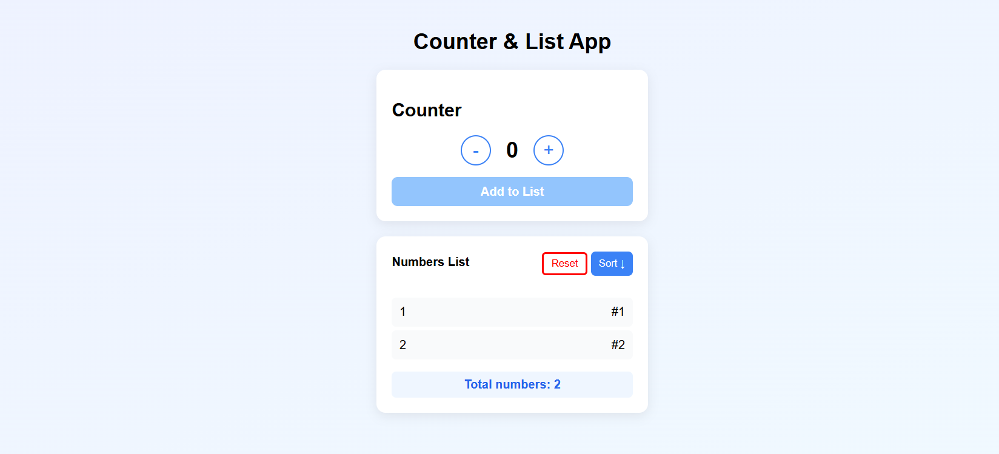
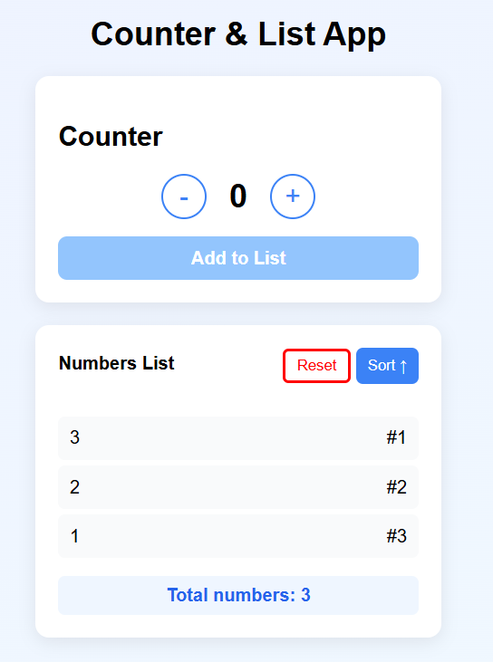

<h1>Counter & List App</h1>
<h3>Tech Stack</h3>

Vite: React, CSS, Javascript

Clone the project, 
get into the project folder,
Run the command: npm run dev
Project runs at loaclhost:5000 port

<pre>Working prototype of project
- Home page

- Adding numbers using buttons

- sorting based on ascending or descending

</pre>
